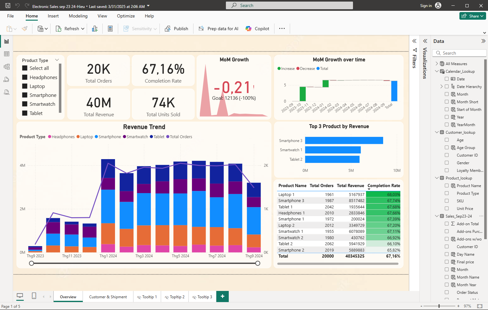
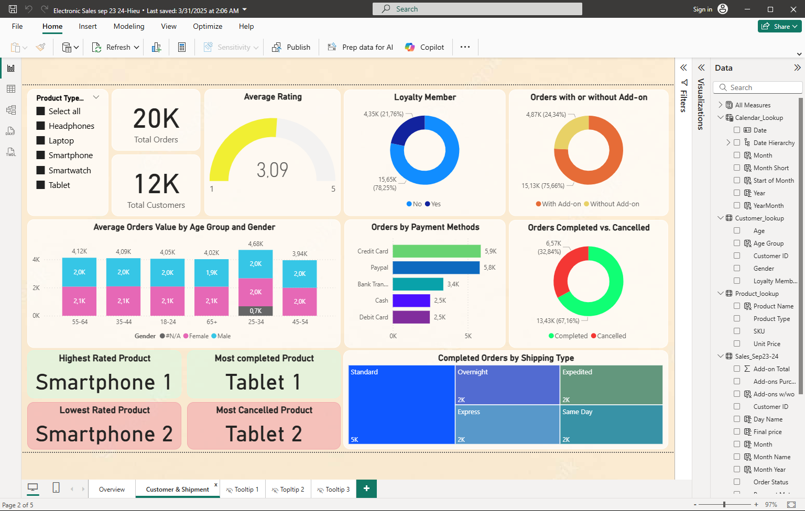

# 📊 Electronic Sales Dashboard

Welcome to the Electronic Sales Dashboard — an interactive Power BI report that visualizes electronic product sales and shipment trends for Sep 2023 through Sep 2024.

## What you will find here

- `sales dashboard.pbix` — Power BI Desktop report with visuals, measures, and interactive pages.
- `dataset/Electronic_sales_Sep2023-Sep2024.csv` — The CSV used for analysis.

## Highlights

- Exploratory Data Analysis (EDA) to uncover sales trends and seasonality.
- Power Query transformations for data cleaning.
- DAX measures for revenue, growth, and shipment KPIs.
- Interactive filters, slicers and drill-through for detailed analysis.

## Preview

Overview of the dashboard:

Customer shipment analysis:

## Getting Started

1. Install Power BI Desktop: https://powerbi.microsoft.com/desktop/
2. Clone or download this repository.
3. Open `sales dashboard.pbix` in Power BI Desktop.
4. If you want to refresh the data, open `dataset/Electronic_sales_Sep2023-Sep2024.csv` or replace it with your own data and refresh in Power BI.

## Contact

If you have feedback or questions, contact the repository owner.

